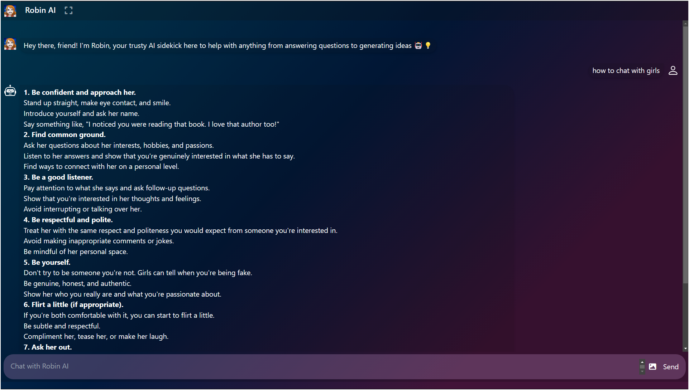

# Robin AI

Robin AI is a cutting-edge chat application powered by Google's Generative AI, designed to provide a seamless and interactive experience with an AI assistant. It features an intuitive user interface and a responsive design to ensure users can easily engage with the assistant across different devices.

## Features

- **AI-Powered Chat**: Engage in natural language conversations with a Google Generative AI assistant.
- **User-Friendly Interface**: An intuitive and easy-to-navigate design.
- **Responsive Design**: Fully responsive layout, optimized for desktop, tablet, and mobile devices.
- **Customizable UI**: Tailored to fit your branding needs with flexibility.
- **Real-time Messaging**: Instant AI responses for a smooth chat experience.

## Technologies Used

- **HTML**: Provides the basic structure of the web pages.
- **CSS**: Used for styling and enhancing the visual design.
- **JavaScript**: Handles interactive elements and AI communication.
- **Tailwind CSS**: Utility-first CSS framework for fast and responsive styling.
- **Google Generative AI API**: Powers the chat assistant with state-of-the-art natural language processing.

## Live Demo

You can check out the live version of Robin AI here:

[Live Demo](https://robin-ai-nine.vercel.app/)

### Preview
Here’s a preview of what the chat application looks like:



## Installation

To set up the project locally, follow these steps:

1. **Clone the repository:**
   ```bash
   git clone https://github.com/prateekraiger/Robin-AI.git
   ```

2. **Navigate to the project directory:**
   ```bash
   cd robin-ai
   ```

3. **Install dependencies:**
   If you haven't installed Node.js and npm yet, install them first. Then, install the required dependencies:
   ```bash
   npm install
   ```

4. **Set up your Google API Key:**
   - Obtain a Google Generative AI API key from the [Google Cloud Console](https://console.cloud.google.com/).
   - Create a `.env` file in the root directory and add your API key:
     ```
     VITE_API_KEY=your-api-key-here
     ```

5. **Run the application:**
   After setting up the API key, start the development server:
   ```bash
   npm start
   ```

   The application should now be accessible at `http://localhost:3000`.

## Usage

- Open the app in your browser.
- Type your queries in the chat window to interact with the AI assistant.
- The assistant will respond in real-time with relevant answers and assistance.

## Contributing

We welcome contributions! If you'd like to contribute to the development of Robin AI, please follow these steps:

1. Fork the repository.
2. Create a new branch (`git checkout -b feature-branch`).
3. Make your changes and commit them (`git commit -am 'Add feature'`).
4. Push your changes to your fork (`git push origin feature-branch`).
5. Create a pull request.

##  License
----------
 
Robin.AI is licensed under the [Apache 2.0 License](https://www.apache.org/licenses/LICENSE-2.0.txt)

